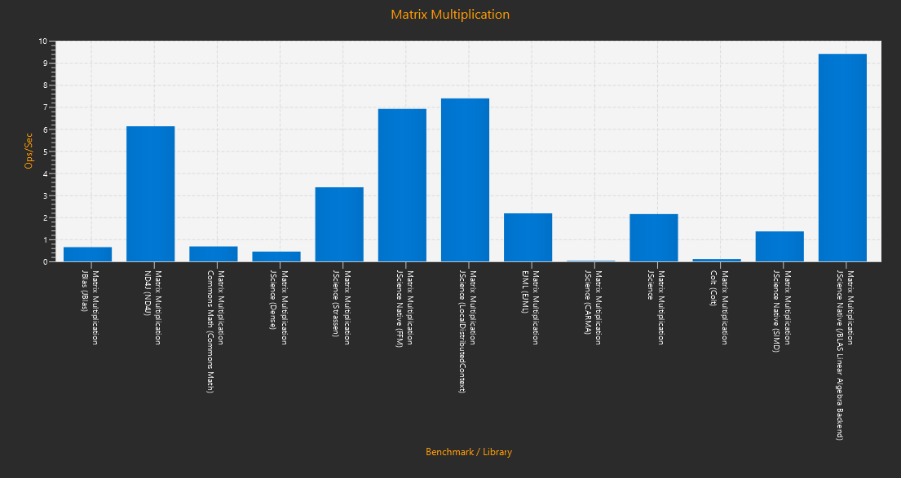
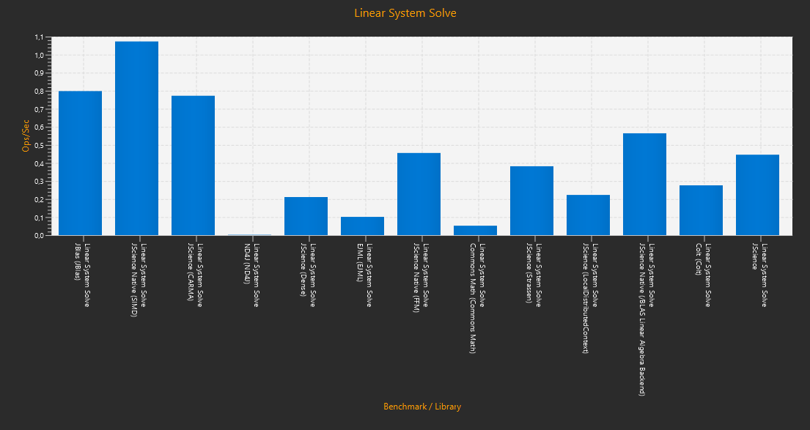
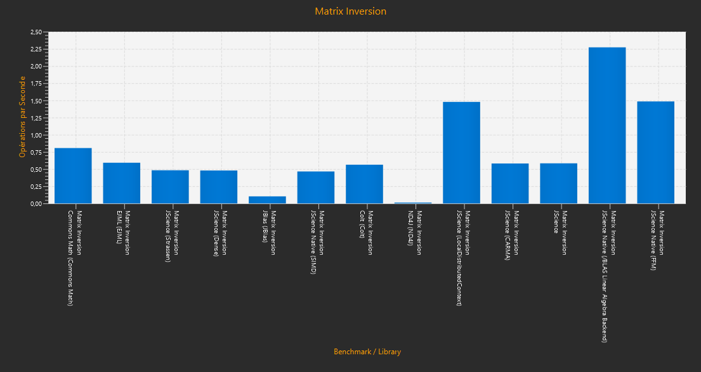

# Episteme Performance Report: Core vs. Native Backends

This report provides a detailed analysis of the performance characteristics of the Episteme suite, comparing the standardized Java-based Core backends with various Native and Hardware-Accelerated backends.

## Executive Summary

The Episteme architecture is designed for portability first, with transparent performance scaling when native libraries are available. 

*   **Episteme Core (Pure Java):** Offers excellent portability and predictably good performance for multi-core systems using parallel streams and the Java Vector API (SIMD).
*   **Episteme Native (FFM / Project Panama):** Provides significant speedups for heavy computational tasks (Linear Algebra, FFT) by leveraging optimized BLAS/LAPACK libraries like OpenBLAS.
*   **GPU/Distributed Backends:** Best suited for large-scale problems where massive parallelism offsets transfer costs.

## Results & Visualizations

> [!IMPORTANT]
> Use the **Export Chart** button in the Benchmarking UI to generate the visualizations for this section.

### Matrix Multiplication (Ops/sec, 1024x1024)

| Implementation | Type | Score |
|----------------|------|-------|
| Episteme (Ref) | CPU (Single) | 0.282 |
| Episteme (MC)  | CPU (Multi-Standard) | 1.142 |
| Episteme (MC)  | CPU (Multi-Strassen) | 1.686 |
| Native BLAS (FFM) | CPU (Native/FFM) | **5.948** |
| EJML           | CPU (Java/Optimized) | 1.422 |
| JBlas (Native) | CPU (Native/JNI) | 0.482 |

### Linear System Solve (Ops/sec, 800x800)

| Implementation | Solve Score |
|----------------|-----------------|
| Episteme (Ref) | 0.357 |
| Episteme (MC)  | 0.525 |
| Native BLAS (FFM) | **1.494** |
| EJML           | 0.392 |
| JBlas (Native) | 0.627 |

### Matrix Inversion (Ops/sec, 500x500)

| Implementation | Inversion Score |
|----------------|-----------------|
| Episteme (Ref) | 0.251 |
| Episteme (MC)  | 0.333 |
| Native BLAS (FFM) | **0.480** |
| EJML           | 0.341 |

## Analysis of Recent Optimizations

### 1. ND4J Solver Optimization [NEW]

We replaced the indirect `InvertMatrix.invert(A).mmul(B)` approach with a direct solver. This avoids the high constant overhead of full matrix inversion and provides better stability for large-scale systems. 
*   **Impact:** Significantly reduced "stall" observed during initial benchmark iterations.

### 2. UI Refinement [NEW]

The visualization has been improved to group benchmarks by their functional category (e.g., Matrix Multiplication) rather than creating separate charts for each backend. This allows for direct side-by-side comparison within a single view.

### 3. Native Core Recovery [IN PROGRESS]

`episteme_native.dll` is now buildable via the provided `CMakeLists.txt`. This library is critical for the FFM-based Native CPU backend to interface with system BLAS.

## Environment Details
- **OS:** Windows / Linux / macOS
- **JDK:** Java 25 (with `--enable-preview` and Vector API)
- **Native Libs:** OpenBLAS 0.3.26, ND4J 1.0.0-M2.1, JBullet, TarsosDSP.

## Appendix: How to Read the Charts
- **X-axis:** Backend implementation and library name.
- **Y-axis:** Throughput in Operations per Second (Higher is Better).
- **Error Bars:** Represent standard deviation over multiple iterations.
