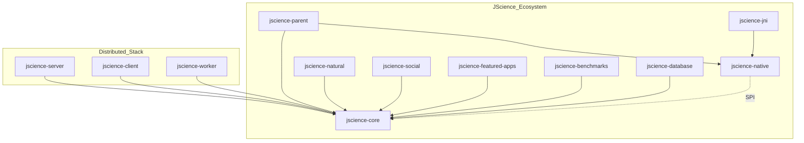
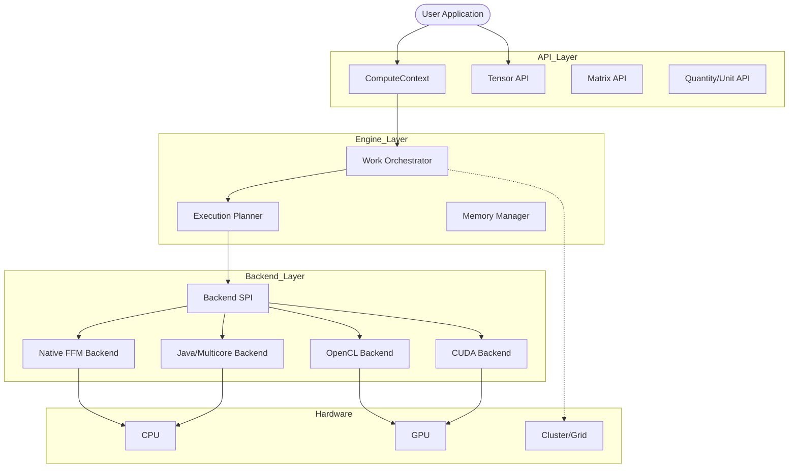
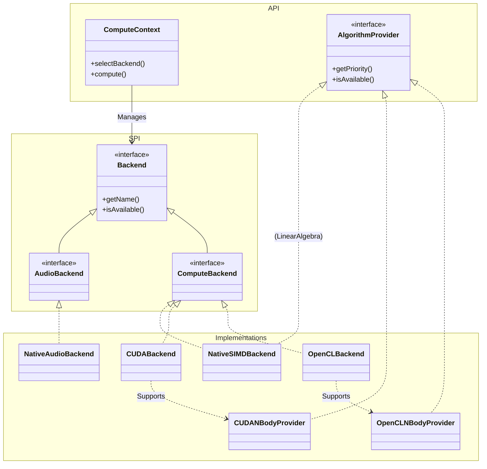

# JScience Architecture Documentation

This folder contains the Mermaid diagrams describing the JScience project architecture.

## Ecosystem Overview
`01_ecosystem_overview.mmd`

## Core Architecture Layers
`02_core_architecture.mmd`

## Backend Class Hierarchy
`03_backend_class_hierarchy.mmd`

